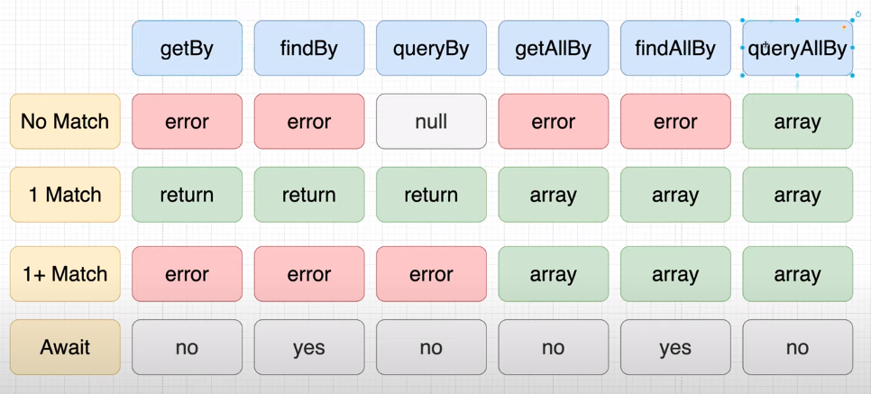

# Learn React Testing Library Net Ninja

## Content:
- We can use `test` or `it` to write the tests.
- We can use `describe` to write a suite of tests.
- Inside test block:
  - Render a component we want to test
    ```javascript
    test('testing here', () => {
      ...
      render(<App />)
      ...
    })
    ```
  - Find the elements we want to interact
    ```javascript
    test('renders learn react link', () => {
      ...
      const linkElement = screen.getByText(/learn react/i);
      ...
    });
    ```
  - Interact with those elements
    ```javascript
    test("Test theme button toggle", () => {
      ...
      userEvent.click(buttonEl);
      ...
    });
    ```
  - Assert the result with the expected
    ```javascript
    test('renders learn react link', () => {
      ...
      expect(linkElement).toBeInTheDocument();
      ...
    });
    ```
- findAll... methods return an array
- findBy.... methods return a single object
- The differences between find, get and query
  
- The test has to mimic the user interaction as close as possible
- The priority of finding elements:
  - Accessible by everyone:
    - getByRole
    - getByLabelText
    - getByPlaceholderText
    - getByText
  - Semantic queries: (accessible by screen readers)
    - getByAltText
    - getByTitle
  - TestID: (user can't see or know test id)
    - getByTestId
- Snippet for getBy...
  ```javascript
  it('should render the header title', () => {
    render(<Header title='My Header' />)

    const element = screen.getByText(/My Header/)
    expect(element).toBeInTheDocument()
  })

  it('should render heading, search by role', () => {
    render(<Header title='My Header' />)

    const element = screen.getByRole('heading')
    expect(element).toBeInTheDocument()
  })

  it('should render heading with the same text content', () => {
    render(<Header title='My Header' />)

    const element = screen.getByRole('heading')
    expect(element.textContent).toBe('My Header')
  })

  it('should render heading, search by role with name', () => {
    render(<Header title='My Header' />)

    const element = screen.getByRole('heading', { name: 'My Header' })
    expect(element).toBeInTheDocument()
  })

  it('should render heading, search title', () => {
    render(<Header title='My Header' />)

    const element = screen.getByTitle(/My Header/)
    expect(element).toBeInTheDocument()
  })

  it('should render heading, search by test id', () => {
    render(<Header title='My Header' testId="header"/>)

    const element = screen.getByTestId(/header/)
    expect(element).toBeInTheDocument()
  })
  it('should render heading, search by get all', () => {
    render(<Header title='My Header' testId="header"/>)

    const element = screen.getAllByText(/My Header/)
    expect(element.length).toBe(1)
  })
  ```
- Snippet for findBy...
  ```javascript
  it('should render heading, search by find by', async () => {
    render(<Header title='My Header' testId="header"/>)

    const element = await screen.findByText(/My Header/)
    expect(element).toBeInTheDocument()
  })
  ```
- Snippet for queryBy...
  ```javascript
  it('should render heading, search by query by', () => {
    render(<Header title='My Header' testId="header"/>)

    const element = screen.queryByText(/My Footer/)
    expect(element).not.toBeInTheDocument()
  })
  ```
- Common assertions (Most of them are quite self-explainable):
  - toBe: to assert equality
  - toBeTruthy: to assert that the value is truthy
  - toBeVisible: to assert that our component is visible to the user, not just exists within the document
  - toContainHTML: to assert that the element contain some element tag
  - toHaveTextContent: to assert the text content of the element
  - not: to negate the assertion method
- `expect(element.textContent).toBe('Some text content')` could be used to assert the text content
- Using `describe` block to put similar tests into one suite
  ```javascript
  describe('Some description of suite', () => {
    ...tests here
  })
  ```
- `fireEvent` object:
  - Change input value event: </br>
    ```javascript
    it('should change value of input component', () => {
        render(<AddInput todos={[]} setTodos={mockedSetTodo} />)

        const element = screen.getByPlaceholderText(/Add a new task here.../i)
        fireEvent.change(element, { target: { value: 'Some todo here' } })
        expect(element.value).toBe('Some todo here')
    })
    ```
  - Button click event: </br>
    ```javascript
    it('should have empty input value after click the button', () => {
        render(<AddInput todos={[]} setTodos={mockedSetTodo} />)

        const inputElement = screen.getByPlaceholderText(/Add a new task here.../i)
        fireEvent.change(inputElement, { target: { value: 'Some todo here' } })
        const buttonElement = screen.getByText(/Add/i)
        fireEvent.click(buttonElement)
        expect(inputElement.value).toBe('')
    })
    ```
- `toHaveClass` assertion to assert the class of a component
  ```javascript
  it('add one todo and assert the class of the todo component', () => {
        render(<MockedTodo />)

        const inputValue = 'My new todo'
        addTodos([inputValue])

        const todoElement = screen.getByText(inputValue)
        expect(todoElement).not.toHaveClass('todo-item-active')
  })
  ```
- Test with async snippet
  ```javascript
  it('should render follower', async () => {
      render(<MockedFollowerList />)

      const element = await screen.findByTestId(/follower-item-0/i)
      expect(element).toBeInTheDocument()
  })
  ```
- Several reasons why we have to mock API instead of using it:
  - Requests cost money
  - Requests are slow
  - Our tests depend on something external
- How to mock axios:
  - Add jest settings: </br>
    ```javascript
    "jest": {
      "collectCoverageFrom": [
        "src/**/*.{js,jsx,ts,tsx}"
      ],
      "resetMocks": false
    }
    ```
  - Mocking axios: </br>
    ```javascript
    const mockedResponse = {
      data: {
        results: [
          {
            name: {
              first: "Sherlock",
              last: "Holmes"
            },
            picture: {
              large: 'https://randomuser.me/api/portraits/women/72.jpg'
            },
            login: {
              username: 'SherlockHolmes'
            }
          }
        ]
      }
    }

    const mockedAxios = {
      get: jest.fn().mockResolvedValue(mockedResponse)
    }

    export default mockedAxios
    ```

## References:
- https://www.youtube.com/playlist?list=PL4cUxeGkcC9gm4_-5UsNmLqMosM-dzuvQ
- https://github.com/harblaith7/React-Testing-Library-Net-Ninja